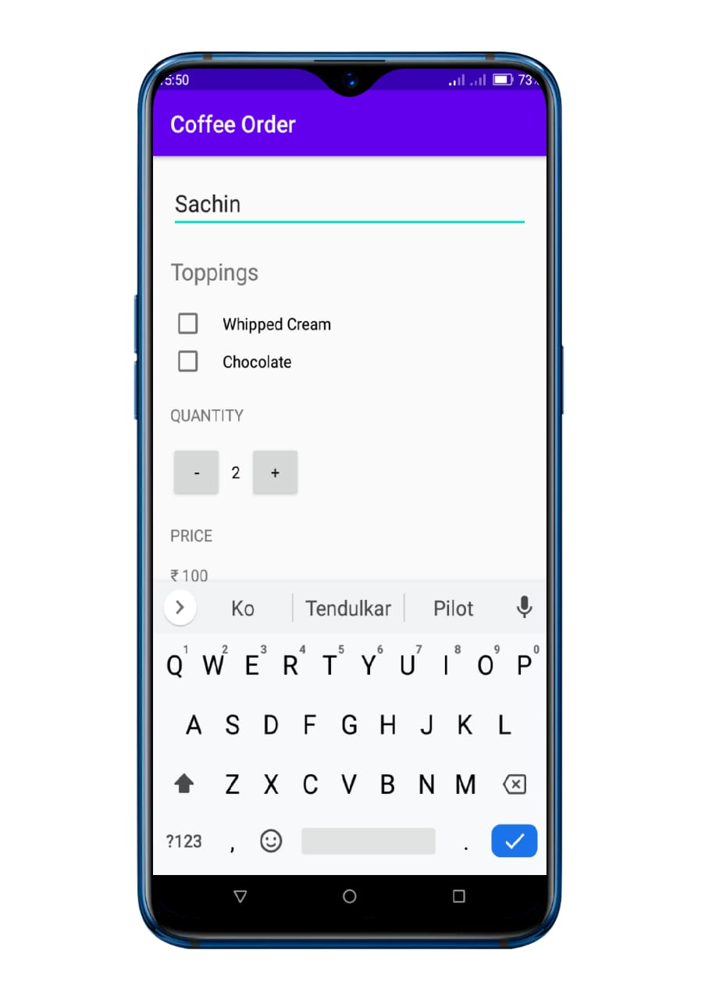
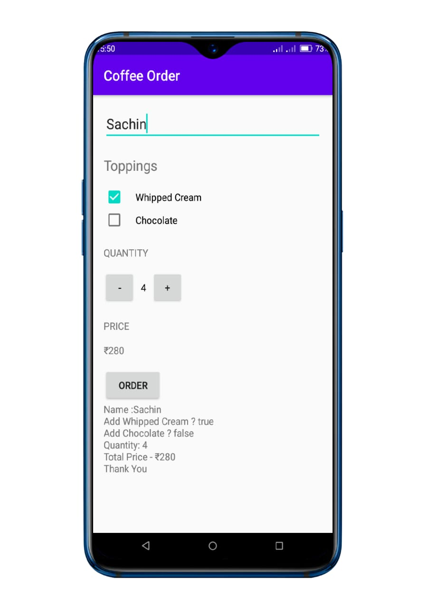

# Coffee_Order
This app displays an order form for coffee. Created while learning Android Nanodegree Udacity course.

## Screensshots of the app

  
  
  

## Why?
I believe that we can find something interesting and gain helpful skills.

## How?
It's WELCOMED for you to star and fork this project.
If you know something that is not here, it'll be great if you could make a Pull Request.

## Accepted Types of Contributions
- Bug fixes
- Each bug fix is expected to come with tests
- Fixing spelling errors
- Adding new tests to the area that is not currently covered by tests
- Adding new features
